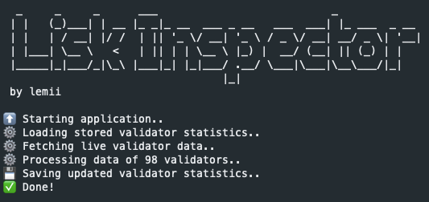

# Lisk Inspector

Lisk Inspector keeps track of the performance of active validators in the Lisk ecosystem. It generates data that is consumed by the Lisk Inspector frontend.

## Installation

```sh
git clone https://github.com/lemii/lisk-inspector
cd lisk-inspector
npm i
```

## Usage

```sh
# Edit environment variables
nano .env

# Run dev
npm run dev

# Run prod
npm run build
npm start

# Run as PM2 process
pm2 start npm --name "lisk-inspector" -- run start && pm2 log

```

## License

[MIT](LICENSE)
